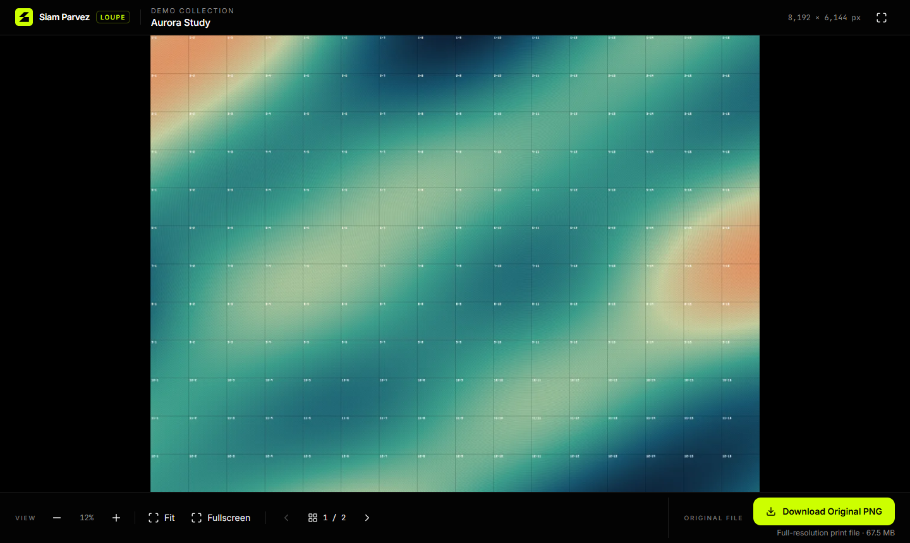

# Loupe

[](https://github.com/siam-parvez/loupe/actions/workflows/ci.yml)
[](LICENSE)

**Show clients huge print files without making them download huge print files.**

Loupe is a self-hosted deep-zoom viewer for very large PNG artwork (200 MB+, 30 000+ px). Your client opens a link and sees the whole piece within seconds, even on a slow laptop, because the browser only loads the small WebP tiles on screen. When they need the real thing, one button downloads the untouched original PNG.



- **Fast on weak hardware.** A 215 MB, 5 500 × 75 000 px banner opens with about 1.3 MB of tiles.
- **Honest downloads.** The original PNG is copied byte for byte and checked with SHA-256. The viewer never uses it for display.
- **Several images per project,** with previous/next arrows and a thumbnail tray.
- **Built for non-technical clients:** big obvious controls, pinch, double-tap, fullscreen, and a minimap on desktop.
- **Storage you can swap:** local disk today, Cloudflare R2 or any S3-style bucket later.
- **One command to prepare:** `pnpm viewer:prepare artwork.png`.

Stack: Next.js 16 (App Router) · TypeScript · pnpm · React 19 · Tailwind CSS 4 · OpenSeadragon 6 · sharp · Lucide.

Made by [Siam Parvez](https://siamparvez.com). The default branding is mine; see [Branding](#branding) to make it yours.

## Quick start

```bash
pnpm install
pnpm dev            # the first run generates a demo project (takes about 20 s)
```

Then open <http://localhost:3000/viewer/demo>. The demo project holds two generated test images.

## Prepare an artwork

```bash
pnpm viewer:prepare ./path/to/artwork.png
pnpm dev
```

This creates the project `artwork` (the id comes from the file name), viewable at `/viewer/artwork`.

To put several images in one client project:

```bash
pnpm viewer:prepare ./front.png ./back.png --project acme-poster --project-title "Acme Poster"
```

| Flag                                       | Meaning                                         |
| ------------------------------------------ | ----------------------------------------------- |
| `--project <id>`                           | Project id (lowercase letters, numbers, dashes) |
| `--project-title`, `--project-description` | Shown in the header                             |
| `--id`, `--title`, `--description`         | Per-image values (single image only)            |
| `--quality <1-100>`                        | WebP tile quality (default 85)                  |
| `--force`                                  | Replace an image that already exists            |

Running the command again with the same `--project` **adds** images to that project. Each image gets its own URL: `/viewer/<project>/<image>`.

## Project structure

```text
app/
  layout.tsx, globals.css         Brand fonts, colours, metadata
  page.tsx                        Dev-only project list (empty in production)
  not-found.tsx, error.tsx        Friendly error pages
  icon.svg                        Favicon (your logo)
  viewer/[projectId]/
    page.tsx                      First image of a project
    [imageId]/page.tsx            A specific image
    viewer-page.tsx               Shared server renderer
  api/projects/[projectId]/images/[imageId]/
    tiles/[version]/[level]/[tile]/route.ts   Serves WebP tiles (local storage)
    thumbnail/route.ts                        Image-switcher preview
    download/route.ts                         Original PNG (HEAD + Range support)
components/
  BrandMark.tsx, StatusPage.tsx
  image-viewer/
    ArtworkViewer.tsx             Layout: header · stage · VIEW controls | ORIGINAL FILE
    ImageViewer.tsx               OpenSeadragon wrapper
    ViewerControls.tsx            − / zoom % / + · Fit · Fullscreen
    ImageSwitcher.tsx             Prev / next and thumbnail tray for multi-image projects
    DownloadButton.tsx            "Download Original PNG"
    LoadingState.tsx, ErrorState.tsx, useFullscreen.ts
lib/
  brand.ts                        Name, site, email
  images/   dzi.ts pyramid.ts prepare-project.ts format.ts   (tiling: CLI only)
  projects/ types.ts layout.ts validation.ts manifest.ts repository.ts access.ts
  storage/  types.ts local.ts remote.ts index.ts root.ts     (storage abstraction)
  http/     headers.ts responses.ts
scripts/
  prepare-image.ts                pnpm viewer:prepare
  generate-demo.ts, demo-artwork.ts   pnpm viewer:demo (also runs before pnpm dev)
tests/                            node:test unit tests (pnpm test)
projects/                         Prepared artwork (git-ignored)
```

## Where the files live

```text
projects/<projectId>/
  project.json                    Title, image list, sizes, checksums, versions
  images/<imageId>/
    original.png                  Untouched copy of your PNG (SHA-256 verified)
    artwork.dzi                   Deep Zoom descriptor
    thumbnail.webp                ≤512 px preview for the switcher
    tiles/<level>/<col>_<row>.webp
```

- **The original PNG** is copied byte for byte into `original.png` and checked against the source with SHA-256. It is outside `public/`, so there is no static URL for it. The only way to get it is through `/api/projects/<p>/images/<i>/download`, which streams it from disk with `Content-Disposition: attachment; filename="<Title>-Original-Full-Resolution.png"`. The viewer never requests this file.
- **Tiles** are served by the tiles route with `Cache-Control: public, max-age=31536000, immutable`. The URL includes a version segment that changes each time an image is re-prepared, so browsers and CDNs can cache tiles forever and still pick up new versions.

## How the tiles are generated

`lib/images/pyramid.ts` uses sharp (libvips), which reads the PNG in a streaming fashion:

1. It reads the dimensions and rejects anything that isn't a PNG.
2. It computes the levels: level 0 is 1×1 px and the top level is full size, giving `ceil(log2(max(w, h))) + 1` levels (14 for 8 192 px, 16 for 30 000 px).
3. `sharp(...).webp({ quality: 85 }).tile({ size: 512, overlap: 1, layout: 'dz' })` writes the full pyramid and `artwork.dzi`.
4. It checks the result: the DZI must match the source size, and every level must have exactly `ceil(w/512) × ceil(h/512)` tiles, including the last one.
5. It copies the largest single-tile level as the thumbnail.
6. It works in a temporary folder and swaps it into place atomically, so a failed run never breaks a live image.

All tiling happens on your machine or server, never in the browser.

## How OpenSeadragon loads the tiles

The page reads `artwork.dzi` on the server and passes OpenSeadragon an inline Deep Zoom tile source (`{ Image: { Url, Format, TileSize, Overlap, Size } }`). From that, OpenSeadragon requests `<Url><level>/<col>_<row>.webp`, which is exactly the layout sharp writes. What that means in practice:

- The first paint needs about 5–10 small tiles, not 200 MB.
- As you zoom, only the visible tiles at the matching level are fetched. Blurry low-resolution tiles show first, and sharper ones blend in.
- For slow machines and connections: the canvas drawer, 4–6 parallel requests, a limit of 60–120 decoded tiles in memory, a 60 s timeout, and no preloading.
- Zoom limits run from fit-to-screen up to 200 % of actual pixels. The image re-fits when the window or phone rotates, unless you have zoomed in.
- Controls: mouse wheel, drag, pinch, double-click or double-tap, keyboard (`+`, `-`, `0`, arrow keys), plus buttons for −, +, Fit and Fullscreen, and a minimap on desktop.

## Show it to a client through ngrok

```bash
pnpm build && pnpm start        # production mode is much faster over a tunnel
ngrok http 3000
```

Send the client `https://<id>.ngrok-free.app/viewer/<project>`. All URLs in the app are relative, so it works on any host. `next.config.ts` allows `*.ngrok-free.app` / `*.ngrok-free.dev` / `*.ngrok.app` in case you tunnel `pnpm dev`. The free ngrok plan shows a one-time warning page and limits bandwidth; a 200 MB download counts against that limit. Nothing in the app depends on ngrok.

## Branding

- Name, site and email: `lib/brand.ts`
- Logo: `components/BrandMark.tsx` and `app/icon.svg`
- Colours: the `@theme` tokens in `app/globals.css`

## Moving assets to Cloudflare R2

The storage layer (`lib/storage`) has a `local` driver and a `remote` driver that reads over HTTP.

1. Prepare the images locally as usual.
2. Upload `projects/` to a public R2 bucket, keeping the same paths, but leave out the originals. For example:
   `rclone copy projects r2:artwork-assets/projects --exclude "*/images/*/original.png"`
3. Upload the originals to a **separate, private** bucket with the same paths.
4. Add a custom domain to the tiles bucket and set CORS to allow `GET` from your site's origin (OpenSeadragon loads tiles with `crossOrigin="anonymous"`).
5. Set the environment variables:

   ```bash
   VIEWER_STORAGE_DRIVER=remote
   VIEWER_ASSET_BASE_URL=https://assets.example.com/projects
   VIEWER_ORIGINALS_BASE_URL=https://originals.example.com/projects
   ```

6. In `lib/storage/remote.ts`, change `resolveOriginal` so it returns a short-lived presigned R2 URL (with `aws4fetch` or `@aws-sdk/s3-request-presigner`). The download route already redirects to whatever URL `resolveOriginal` returns.

After this, tiles go straight from Cloudflare's CDN to the browser. The app only reads `project.json` and `artwork.dzi` (cached for 60 s).

## Private projects later

Every page and asset route goes through `canViewProject()` in `lib/projects/access.ts`. To add a private project:

1. Extend `ProjectAccess`, for example with `{ mode: 'password', passwordHash }`.
2. Check a session cookie inside `canViewProject()`.
3. Add a small password page.

Visitors who aren't allowed in already get a 404.

## Scripts

| Command                                        | Purpose                                       |
| ---------------------------------------------- | --------------------------------------------- |
| `pnpm dev`                                     | Dev server (creates the demo if it's missing) |
| `pnpm build && pnpm start`                     | Production server                             |
| `pnpm viewer:prepare`                          | Prepare PNG(s) into a project                 |
| `pnpm viewer:demo`                             | Regenerate the demo project                   |
| `pnpm test`                                    | Unit tests                                    |
| `pnpm lint` / `pnpm typecheck` / `pnpm format` | Code quality                                  |

## Contributing

Issues and pull requests are welcome. Before opening a PR:

```bash
pnpm typecheck && pnpm lint && pnpm format:check && pnpm test
```

Please never commit real client artwork. `projects/` and `.cache/` are git-ignored for that reason.

## License

[MIT](LICENSE) © [Siam Parvez](https://siamparvez.com)
